RadnoOkruzenje
====
Radno okruženje - 1. seminar backend

Zahtjevi
====

-XAMPP (https://www.apachefriends.org/index.html)

-Netbeans (https://netbeans.org/)

-HeidiSQL (http://www.heidisql.com/)

-Git (https://git-scm.com/downloads)

-Composer (https://getcomposer.org/)

-VS Code (https://code.visualstudio.com/download)

Instalacija Sambe:
====
https://kifarunix.com/install-and-configure-samba-file-server-on-ubuntu-20-04/

Instalacija Apache:
====

Instalacija VirtualBox Ubuntu:
====

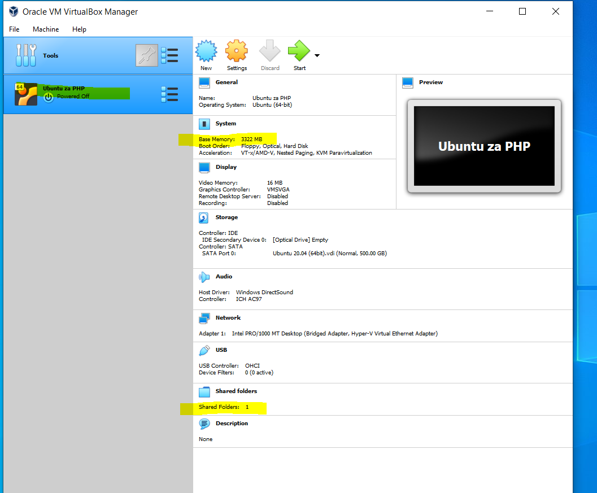
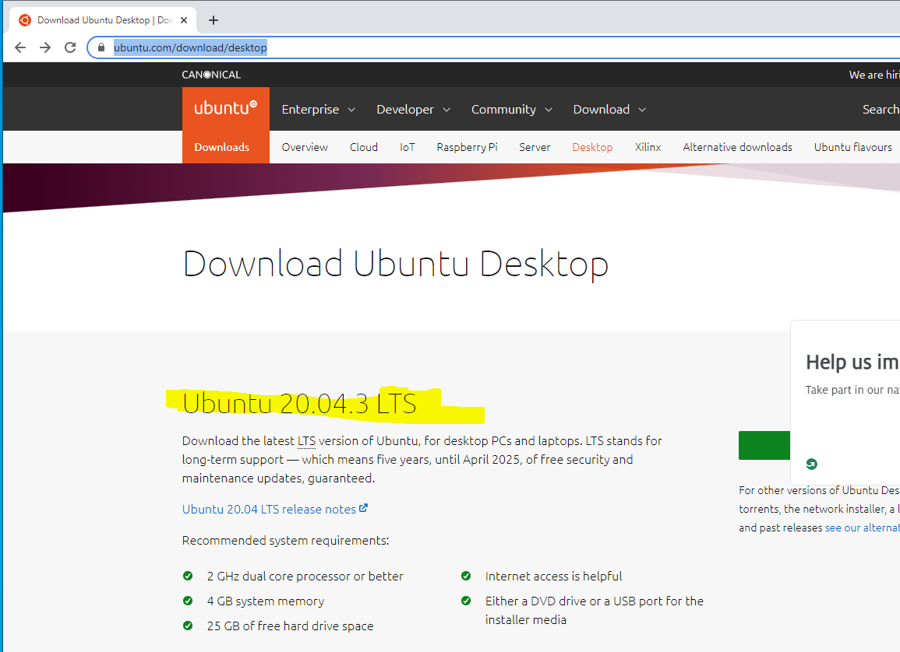
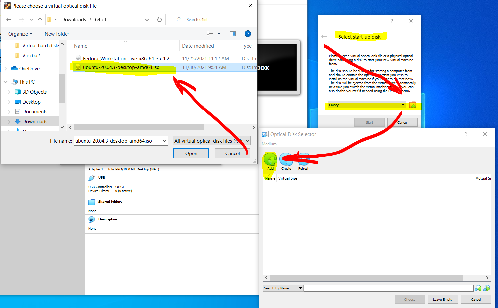
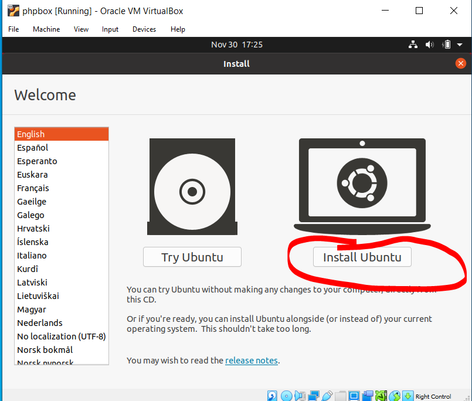
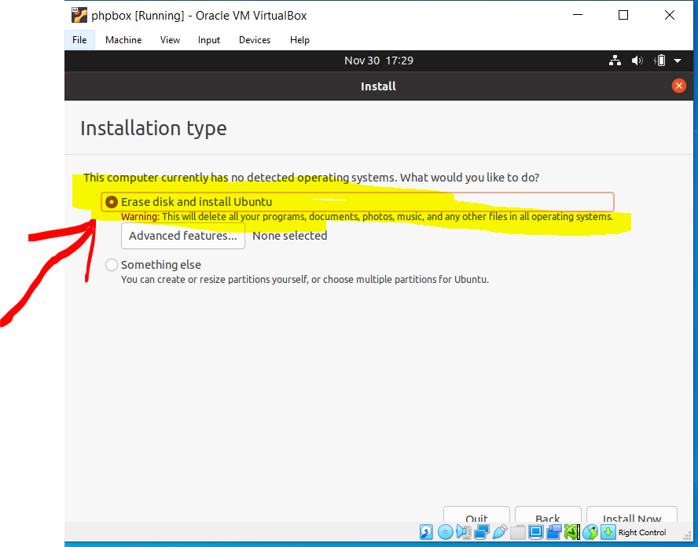
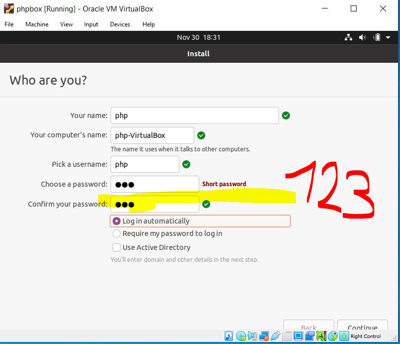

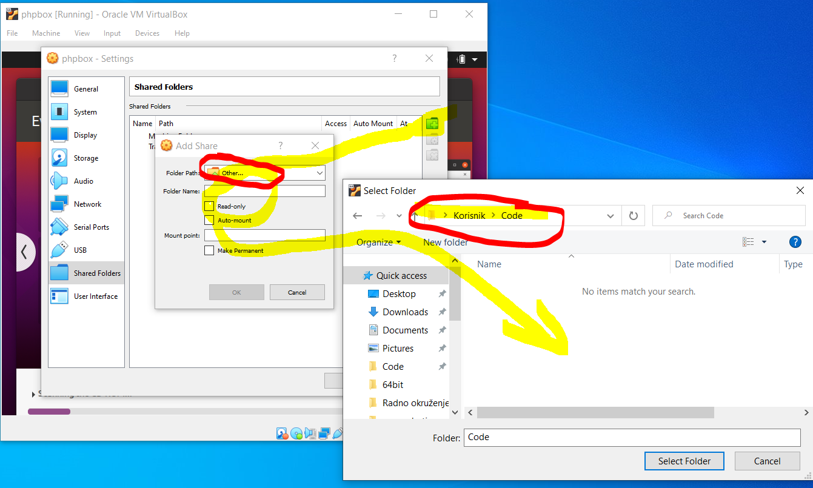

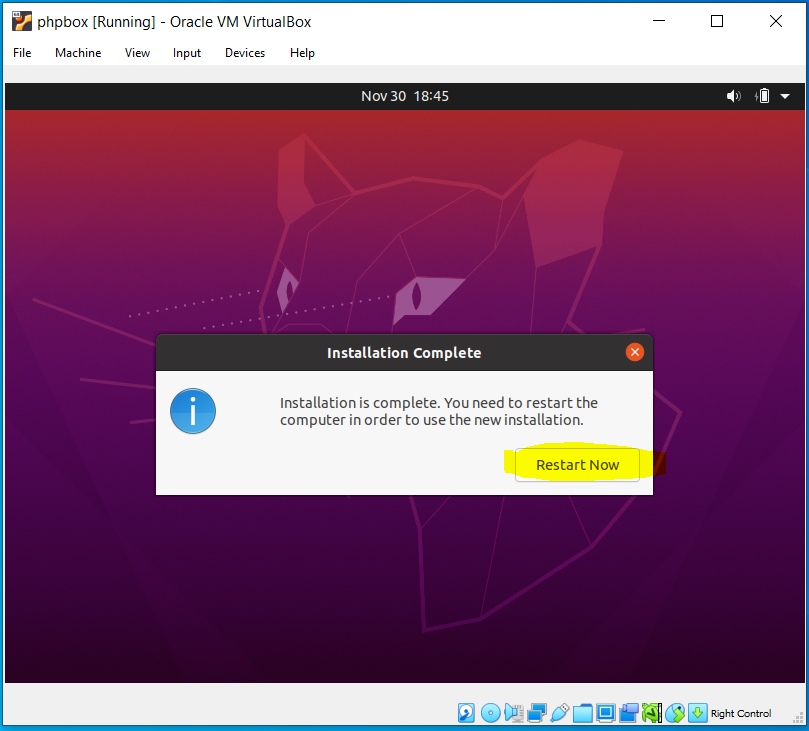
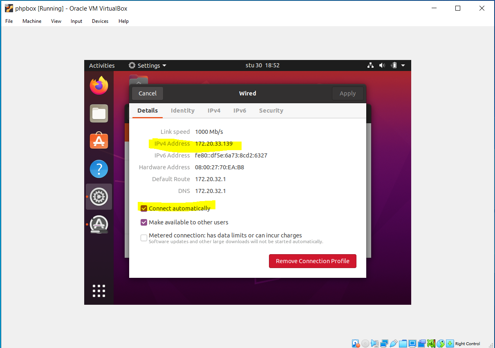
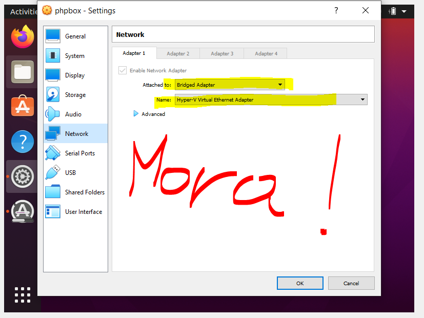
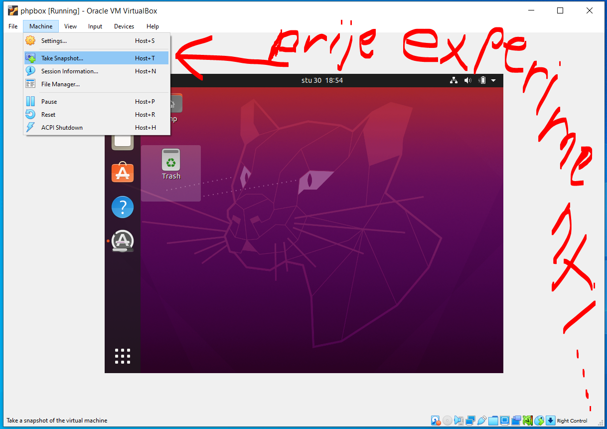

